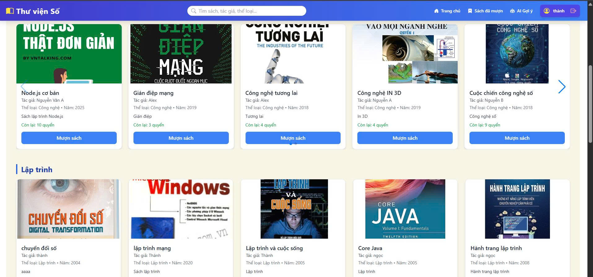
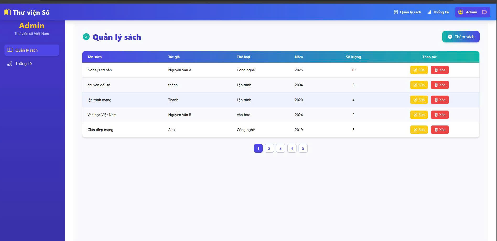
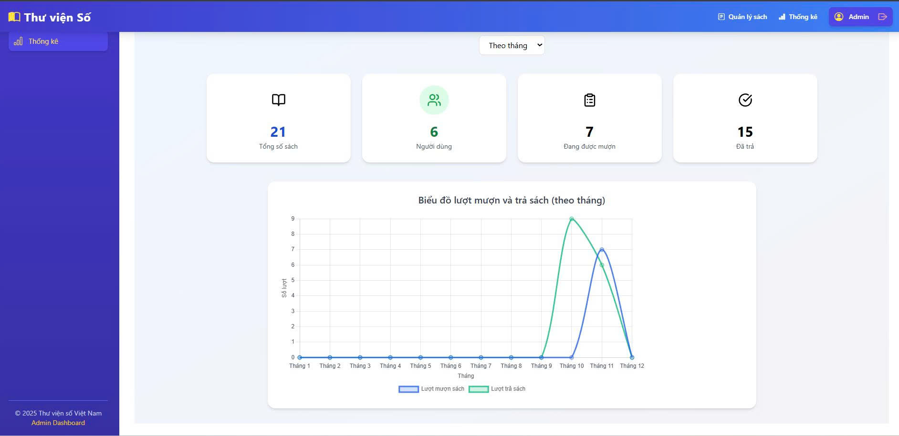
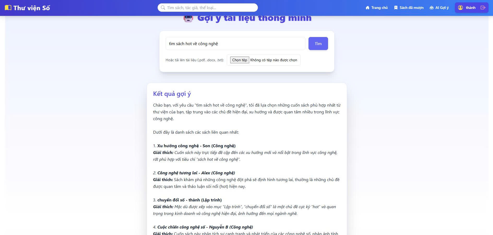

<h2 align="center">
    <a href="https://dainam.edu.vn/vi/khoa-cong-nghe-thong-tin">
    🎓 Faculty of Information Technology (DaiNam University)
    </a>
</h2>

<h2 align="center">
    PHÁT TRIỂN HỆ THỐNG QUẢN LÝ THƯ VIỆN SỐ TÍCH HỢP AI GỢI Ý TÀI LIỆU
</h2>

<div align="center">
    <p align="center">
        
        
        
    </p>

[](https://www.facebook.com/DNUAIoTLab)
[](https://dainam.edu.vn/vi/khoa-cong-nghe-thong-tin)
[](https://dainam.edu.vn)
</div>

---

## 🧩 CHƯƠNG 1: GIỚI THIỆU HỆ THỐNG  
**Mục tiêu:**  
Xây dựng một nền tảng thư viện số hiện đại giúp người dùng dễ dàng tìm kiếm, mượn – trả sách, đồng thời tích hợp trí tuệ nhân tạo (AI) để **gợi ý sách phù hợp với sở thích và lịch sử mượn** của từng người dùng.

### 🎯 Chức năng chính

#### 🔹 Người dùng (User)
- Đăng ký, đăng nhập tài khoản  
- Xem danh sách sách, tìm kiếm sách  
- Mượn và trả sách trực tuyến  
- Sử dụng AI để nhận gợi ý sách phù hợp (theo thể loại, lịch sử mượn hoặc đánh giá)  

#### 🔹 Quản trị viên (Admin)
- Quản lý danh sách sách: **Thêm – Sửa – Xóa – Xem chi tiết (CRUD)**  
- Xem **thống kê lượt mượn sách theo tuần hoặc tháng**  
- Hiển thị **Top 5 cuốn sách được mượn nhiều nhất**

---

## 💻 CHƯƠNG 2: CÔNG NGHỆ SỬ DỤNG

| Thành phần | Công nghệ | Mô tả |
|-------------|------------|-------|
| **Frontend** | ReactJS + Tailwind CSS | Giao diện người dùng hiện đại, responsive, dễ sử dụng |
| **Backend** | Node.js (Express.js) | Cung cấp RESTful API, xử lý logic ứng dụng |
| **Cơ sở dữ liệu** | MongoDB | Lưu trữ thông tin sách, người dùng, lịch sử mượn trả |
| **API AI** | Model AI Genimi 2.5 flash | Gợi ý sách dựa trên mô tả hoặc tải file |
| **Authentication** | JWT (JSON Web Token) | Xác thực và phân quyền người dùng, admin |
| **Visualization** | Chart.js | Thống kê mượn sách theo tuần/tháng, Top 5 sách |

---

## 📸 CHƯƠNG 3: HÌNH ẢNH CÁC CHỨC NĂNG

| Giao diện | Mô tả |
|------------|-------|
|  | Màn hình đăng ký đăng nhập |
|  | Giao diện hiển thị danh sách sách |
|  | Giao diện hiển thị danh sách sách mượn trả |
|  | Dashboard quản lý sách cho admin |
|  | Dashboard thống kê dành cho admin |
|  | Giao diện gợi ý sách được đề xuất bởi AI |

---

## ⚙️ CHƯƠNG 4: HƯỚNG DẪN CÀI ĐẶT VÀ SỬ DỤNG
### 🔧 Yêu cầu hệ thống
- **Nodejs**: Phiên bản 23 trở lên  
- **Hệ điều hành**: Windows / macOS / Linux  
- **IDE khuyến nghị**: visual studio code
- **Bộ nhớ**: Tối thiểu 512MB RAM  
---

### 🧱 1. Clone dự án
```bash
git clone https://github.com/mthanh04/Digital_Library.git
cd backend
```
### 🧱 2. Cài đặt các thư viện
```bash
npm install
```
### 🧱 3. Chạy code
- Chạy file backend trước
```bash
cd backend
npm run dev
```
- Chạy file frontend
```bash
cd frontend
npm start
```
## 👤 5. Liên hệ
**Họ tên**: Trịnh Minh Thành.  
**Lớp**: CNTT 16-03.  
**Email**: thanhmeo260604@gmail.com.

© 2025 Faculty of Information Technology, DaiNam University. All rights reserved.

